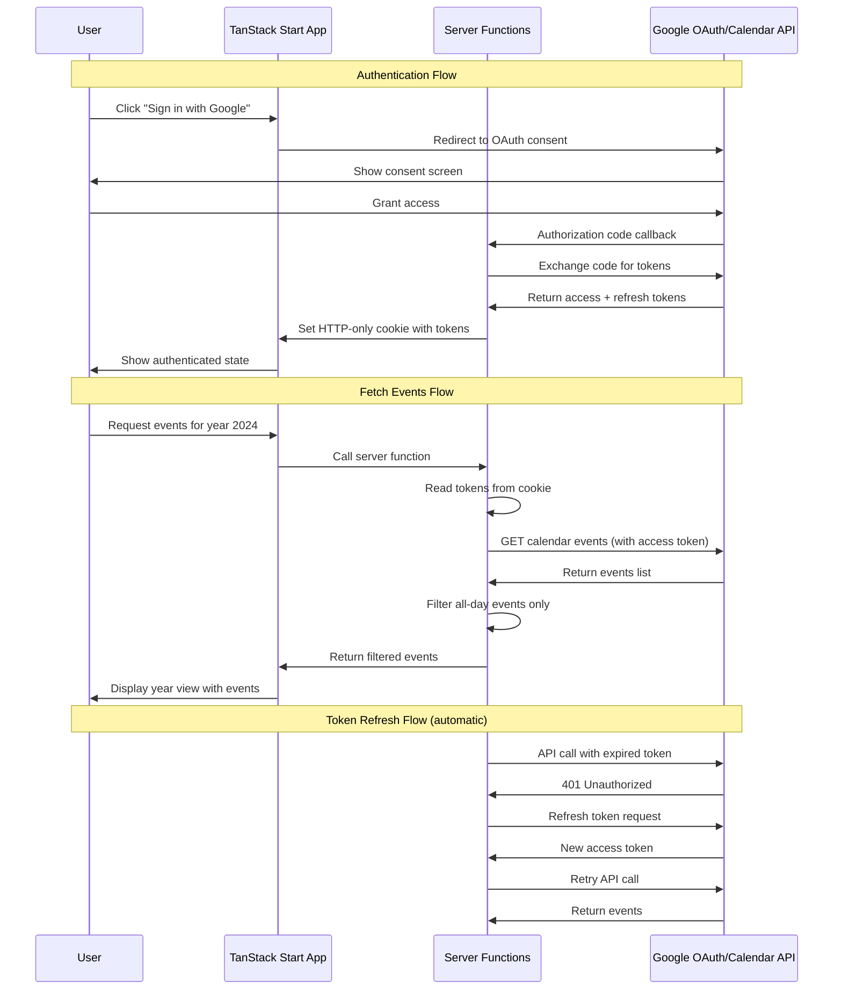

# Google Calendar Integration - Requirements Document

This document defines the requirements for integrating Google Calendar into the Year View application. It specifies **what** needs to be built, serving as a specification for implementing agents.

---

## 1. Overview

The Year View application needs to connect to a user's Google Calendar account and display all "all-day" events for a selected year. This enables users to see their annual commitments, holidays, vacations, and other full-day events in a consolidated view.

### Goals

- Allow users to authenticate with their Google account
- Fetch and display all-day events from the user's primary Google Calendar
- Support viewing events for any selected year
- Maintain persistent sessions so users don't need to re-authenticate on every visit

---

## 2. Authentication Requirements

### OAuth Flow

The application must implement **server-side OAuth 2.0** with Google for the following reasons:

- Access to refresh tokens for persistent sessions
- Secure token storage (tokens never exposed to client-side JavaScript)
- Protection against XSS token theft

### Session Persistence

- User sessions must persist across browser sessions
- Use **HTTP-only secure cookies** to store authentication tokens
- Implement automatic token refresh using refresh tokens
- Sessions should remain valid until:
  - User explicitly signs out
  - Refresh token expires (typically after 6 months of inactivity)
  - User revokes access in their Google account settings

### Required OAuth Scopes

```
https://www.googleapis.com/auth/calendar.readonly
```

This scope provides read-only access to the user's calendar events, which is sufficient for this application's requirements.

### User Flows

#### Sign In Flow

1. User clicks "Sign in with Google" button
2. User is redirected to Google's OAuth consent screen
3. User grants calendar read access
4. Google redirects back to the application with an authorization code
5. Server exchanges the code for access and refresh tokens
6. Server sets HTTP-only cookie with encrypted token data
7. User sees authenticated state in the application

#### Sign Out Flow

1. User clicks "Sign out" button
2. Server clears the authentication cookie
3. Optionally: Revoke the token with Google
4. User sees unauthenticated state

#### Returning User Flow

1. User visits the application
2. Server checks for valid authentication cookie
3. If valid, user is automatically authenticated
4. If token expired, server uses refresh token to obtain new access token
5. If refresh fails, user must sign in again

---

## 3. Functional Requirements

### Event Fetching

- Fetch all events from the user's **primary** Google Calendar
- Filter to only include **all-day events** (events without specific start/end times)
- Support fetching events for a specified year (January 1 through December 31)
- Default to the current year when no year is specified

### Year Selection

- Provide UI for users to select which year to view
- Support navigation between years (previous/next)
- Current year should be the default selection

### Event Display

For each all-day event, display:

- **Title** (summary) - The name of the event
- **Date(s)** - Start date, and end date if it spans multiple days
- **Description** (optional) - Event description if available
- **Color** (optional) - Event color if set in Google Calendar

### Multi-Day Events

- All-day events can span multiple days (e.g., a vacation from Jan 5-10)
- These should be displayed appropriately, showing the full date range
- Consider visual representation that shows the span across days

---

## 4. Data Requirements

### Event Data Structure

The following fields should be extracted from the Google Calendar API response for each all-day event:

| Field | Type | Required | Description |
|-------|------|----------|-------------|
| `id` | string | Yes | Unique event identifier |
| `summary` | string | Yes | Event title |
| `description` | string | No | Event description |
| `start.date` | string (YYYY-MM-DD) | Yes | Start date for all-day events |
| `end.date` | string (YYYY-MM-DD) | Yes | End date (exclusive) for all-day events |
| `colorId` | string | No | Color identifier for the event |
| `status` | string | Yes | Event status (confirmed, tentative, cancelled) |

### Data Source

- **No local database** - All event data is sourced directly from the Google Calendar API
- Data is fetched on-demand when the user requests a year view
- Consider caching strategy for performance (see below)

### Caching Considerations (Optional)

- Cache fetched events in memory or session storage to reduce API calls
- Invalidate cache when user explicitly refreshes
- Consider cache expiration (e.g., 5-15 minutes)
- Be mindful of Google Calendar API quotas

---

## 5. Technical Constraints

### Architecture Compatibility

The implementation must work within the existing application architecture:

- **TanStack Start** - Use the existing router and SSR capabilities
- **Server Functions** - Use `createServerFn` for all Google API interactions
- **Vite + Nitro** - Compatible with the current build and server setup
- **React 19** - Use current React patterns and hooks

### Server-Side Requirements

All Google Calendar API calls must go through server functions because:

- Access tokens are stored server-side in HTTP-only cookies
- Prevents exposure of tokens to client-side code
- Enables automatic token refresh without client involvement

### Environment Variables

The implementation will require the following environment variables:

```
GOOGLE_CLIENT_ID=<OAuth client ID>
GOOGLE_CLIENT_SECRET=<OAuth client secret>
GOOGLE_REDIRECT_URI=<OAuth callback URL>
SESSION_SECRET=<Secret for encrypting session cookies>
```

---

## 6. Google Cloud Setup Requirements

Before implementation, the following must be configured in the Google Cloud Console:

### OAuth Consent Screen

1. Create or select a Google Cloud project
2. Configure the OAuth consent screen:
   - App name: "Year View" (or appropriate name)
   - User support email: Developer's email
   - Scopes: `calendar.readonly`
   - Authorized domains: Application domain(s)
3. For development: Add test users if app is in "Testing" mode

### OAuth Credentials

1. Create OAuth 2.0 Client ID credentials
2. Application type: **Web application**
3. Configure authorized redirect URIs:
   - Development: `http://localhost:3000/api/auth/callback/google`
   - Production: `https://yourdomain.com/api/auth/callback/google`

### Enable APIs

Enable the following API in the Google Cloud Console:

- **Google Calendar API**

---

## 7. Architecture Diagram



---

## 8. Success Criteria

The implementation is complete when:

1. [ ] Users can sign in with their Google account
2. [ ] Users can sign out and clear their session
3. [ ] Sessions persist across browser restarts
4. [ ] All-day events are fetched for a selected year
5. [ ] Users can navigate between different years
6. [ ] Multi-day all-day events display correctly
7. [ ] Error states are handled gracefully (auth failures, API errors)
8. [ ] Token refresh happens automatically without user intervention

---

## 9. Out of Scope

The following are explicitly **not** part of this integration:

- Creating, editing, or deleting calendar events
- Accessing calendars other than the primary calendar
- Real-time event updates or push notifications
- Syncing with multiple Google accounts
- Accessing non-all-day (timed) events
- Offline access to calendar data


